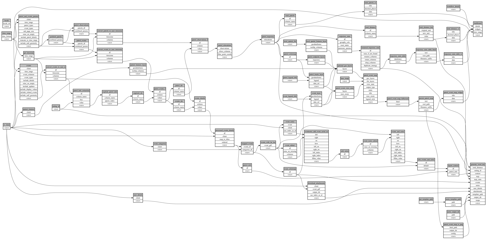

```
# AUTOGENERATED BY ECOSCOPE-WORKFLOWS; see fingerprint in README.md for details

```

```yaml
# fingerprint:
artifacts_sha256_basic: 9b2e45a3ca366d3c20b7798f7d254d787ea8e0fa6a01f7452701f301027de429
artifacts_sha256_strict: 7f17cd0aade38b16313da5fc2fab92d65e83d99a46cd7ed14ff34a37c501e738
installed_requirements:
- channel: https://repo.prefix.dev/ecoscope-workflows/
  name: ecoscope-platform
  version: {version: ==2.23.0}
- channel: https://repo.prefix.dev/ecoscope-workflows-custom/
  name: ecoscope-workflows-ext-custom
  version: {version: ==0.1.0rc23}
- channel: conda-forge
  name: pydeck
  version: {version: ==0.9.2}
- channel: https://repo.prefix.dev/ecoscope-workflows-custom/
  name: ecoscope-workflows-ext-apn
  version: {version: ==0.0.30}
params_sha256: fc133f6f7ad1c05b00f93713050af39067bcfe8cdddd6a781c3a3f02ef8735be
spec_sha256: ed6cf031a742f7936b3d92bd8bc96021f9333e1b8742efebfa299a85810b309e

```

# ecoscope-workflows-patrol-event-workflow


